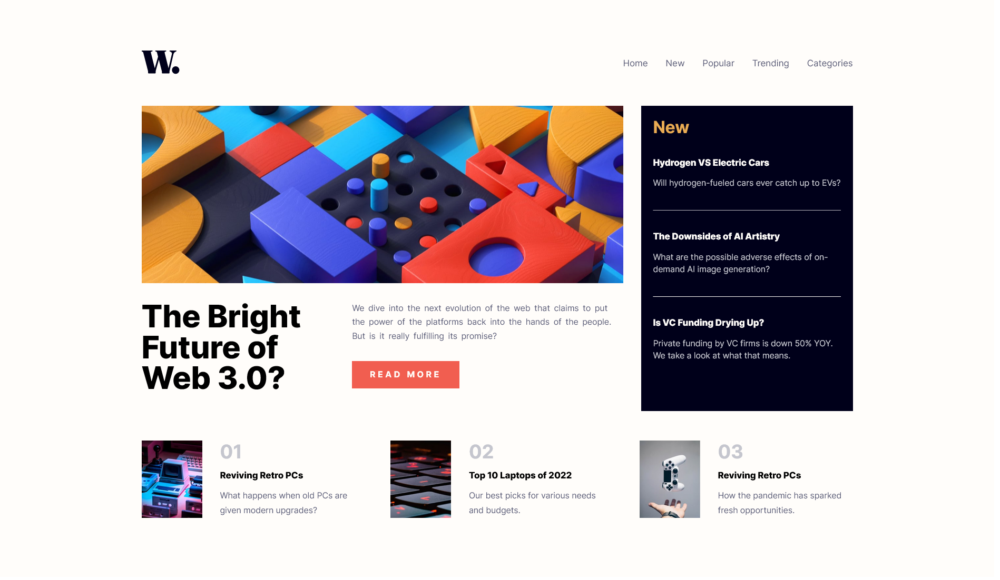

# Frontend Mentor - News homepage solution

This is a solution to the [News homepage challenge on Frontend Mentor](https://www.frontendmentor.io/challenges/news-homepage-H6SWTa1MFl). Frontend Mentor challenges help you improve your coding skills by building realistic projects. 

## Table of contents

- [Overview](#overview)
  - [The challenge](#the-challenge)
  - [Screenshot](#screenshot)
  - [Links](#links)
- [My process](#my-process)
  - [Built with](#built-with)
  - [What I learned](#what-i-learned)
  - [Continued development](#continued-development)

- [Author](#author)

## Overview

### The challenge

Users should be able to:

- View the optimal layout for the interface depending on their device's screen size
- See hover and focus states for all interactive elements on the page

### Screenshot



### Links

- [Solution](https://github.com/nidalA1992/news-page-frontendmentor-)
- Live Site URL: [Add live site URL here](https://your-live-site-url.com)

## My process

### Built with

- Semantic HTML5 markup
- Flexbox
- Mobile-first workflow
- [Pug](https://pugjs.org) - HTML preprocessor
- [SCSS](https://sass-lang.com/) - CSS preprocessor
- [WebPack](https://webpack.js.org/) - Static module bundler


### What I learned

Use Pug loop:

```js
  nav.nav
    ul.nav__list
      - const titles = ['Home', 'New', 'Popular', 'Trending','Categories'];
      each val in titles
        li.nav__list-item
        a(href='#')= val
```
Pug mixins:
```js
  mixin newsCard(img, altImg, index, title, descr)
    li.news
      img.news-preview(src= img, alt= altImg)
      div.news-descr-wrapper
        div.news-index= '0' + (index + 1)
        h4.news-title= title
        p.news-descr= descr
    a(href='#')

```
Pug Template Inheritance and includes:
```js
extends components/layout

block title
  title News
block content
  include components/hero/index
  include components/news/index
  include components/burger-menu/index


```

### Continued development

## Author

- Frontend Mentor - [@nidalA1992](https://www.frontendmentor.io/profile/nidalA1992)
